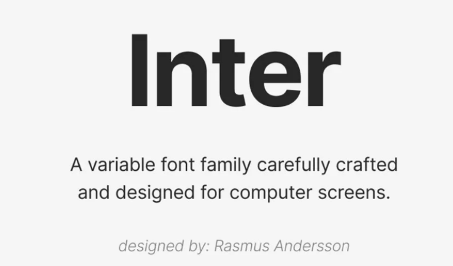
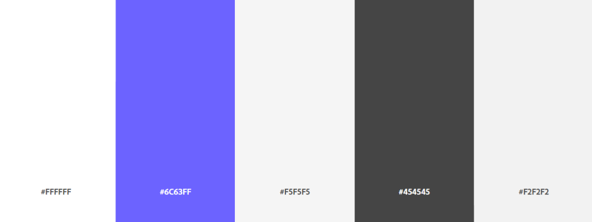
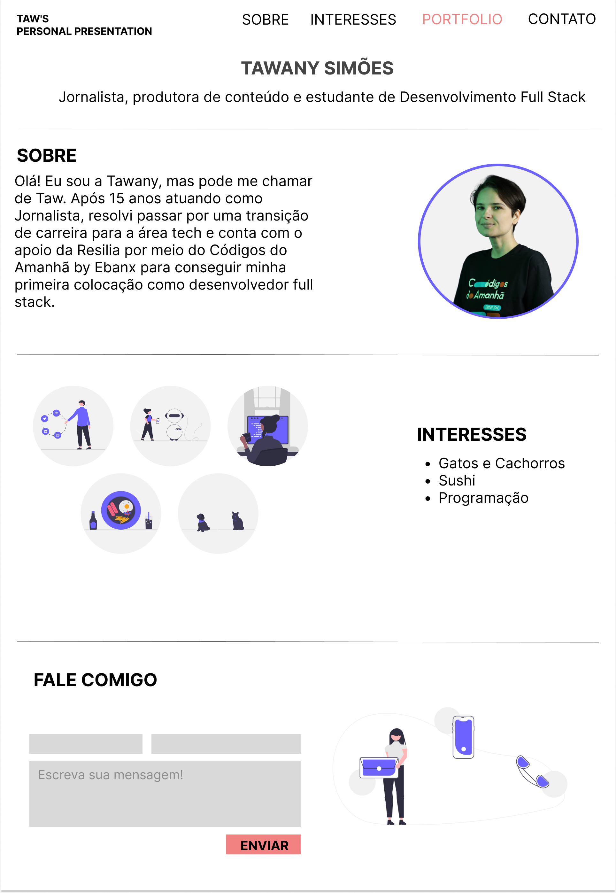

# Apresentação Pessoal | Tawany Simões (Taw)

**Descrição:** Projeto individual intitulado _“Quem não é visto, não é lembrado”_ desenvolvido durante o _Módulo 1 - Introdução ao front-end e criação de hábitos_ do curso de formação _WebDev Full Stack JavaScript_ da _Resilia Educação_ em parceria com o programa _Códigos do Amanhã_ da _EBANX_.

**Objetivo:** O projeto consiste no desenvolvimento de uma one page website utilizando HTML e CSS. O conteúdo da página é uma apresentação pessoal com três seções: “Sobre”, “Interesses” e “Contato”.

**Link da página:** https://devtaw.github.io/personal-presentation-taw/

## ➡️ Fonte utilizada no projeto:

## ➡️ Paleta de cores utilizada no projeto:

## ➡️ Protótipo de baixa fidelidade do projeto:

## 🤝 Colaboradores

<table>
  <tr>
    <td align="center">
      <a href="#">
         
        
          <b>Tawany Simões (Taw)</b>
        
      </a>
    </td>
  </tr>
 </table>
